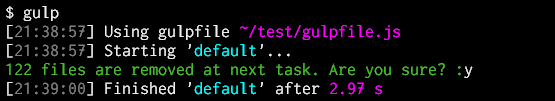
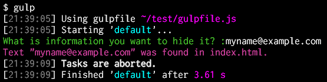

# gulp-confirm

Abort or continue the flow of tasks according to an answer (with or without Enter key) to the specified question. The flow of tasks is paused, until the user responds and the next behavior is found by specified options.





## Getting Started

```shell
npm install gulp-confirm --save-dev
```

## Usage

`gulpfile.js`

```js
var gulp = require('gulp'),
  confirm = require('gulp-confirm');

gulp.task('default', function() {
  return gulp.src('./develop/*.html')
    .pipe(confirm(options))
    // Other tasks...
    .pipe(gulp.dest('./public_html/'));
});
```

### Options

#### `question`

*Type:* string, function or `undefined`

Display a specified string or a returned string by a specified function to the user.  
If the function returns a *falsy*, this task is finished immediately. And the flow of tasks is continued.

If this option is not specified when `'_key'` is specified to the [`input`](#input) option and the [`proceed`](#proceed) option is not specified (i.e. you want to let the flow of tasks just pause), a message `'Continue... (Hit any key)'` is displayed.

For example:

`gulpfile.js`

```js
gulp.task('default', function() {
  return gulp.src('./develop/*.html')
    .pipe(confirm({
      // Static text.
      question: 'This processing requires about 10 minutes. Continue?',
      input: '_key:y'
    }))
    // Other tasks...
    .pipe(gulp.dest('./public_html/'));
});
```

```js
var pattern = './src/*.html';
gulp.task('default', function() {
  return gulp.src(pattern)
    .pipe(confirm({
      question: function() {
        var files = require('glob').sync(pattern);
        return !files.length ? false : // No file. And do nothing.
          files.length + ' files are copied at next task. Are you sure?';
      },
      input: '_key:y'
    }))
    .pipe(gulp.dest('./public_html/'));
});
```

#### `input`

*Type:* string or `undefined`

Accept the user's input that is specified type.

* If it is not specified (i.e. `undefined`), accept a **text** (with an Enter key), and let the [`proceed`](#proceed) option decide whether to continue the flow of tasks.
* If a comma-separated string like `'text1,text2'` is specified, accept a **text** (with an Enter key), and continue the flow of tasks when the input text was found in that comma-separated string, otherwise abort it.
* If `'_key'` is specified, get a pressed **key** (without an Enter key), and let the [`proceed`](#proceed) option decide whether to continue the flow of tasks.
* If a string `'_key:charlist'` is specified, get a pressed **key** (without an Enter key), and continue the flow of tasks when the pressed key was found in that `charlist`, otherwise abort it. The `charlist` is a string that includes characters as the keys. For example, if `'_key:abc'` is specified, continue the flow of tasks when the `A`, `B` or `C` key is pressed.

The string comparisons is case-insensitive (i.e. `a` equals `A`).

#### `proceed`

*Type:* function, boolean or `undefined`

Decide whether to continue the flow of tasks when the [`input`](#input) option is not specified (i.e. `undefined`) or `'_key'` is specified to it.

If a function is specified, call the function, and continue the flow of tasks when that returns a *truthy*, otherwise abort it.  
The function is passed an `answer` argument. It is a string that was input by the user, or a single character as a pressed key by the user.  
The function can determine to abort or continue by using it.

If `false` is specified, the flow of tasks is aborted immediately. And the remaining tasks will not run.  
Otherwise the flow of tasks is continued. That is, when any text was input or any key was pressed, it is continued. It is just paused until it.

For example:

`gulpfile.js`

```js
var pattern = './src/*.*';
gulp.task('default', function() {
  return gulp.src(pattern)
    .pipe(confirm({
      question: 'How many files are required?',
      proceed: function(answer) {
        var files = require('glob').sync(pattern);
        if (files.length < +answer) {
          console.log('There are only ' + files.length + ' files.');
          return false;
        } else {
          return true;
        }
      }
    }))
    // Other tasks...
    .pipe(gulp.dest('./pack/'));
});
```

```js
gulp.task('default', function() {
  return gulp.src('./src/*.*')
    .pipe(confirm({
      question: 'Do you want to build? :',
      input: '_key:y' // Continue the flow if `Y` key is pressed.
    }))
    // Other tasks...
    .pipe(gulp.dest('./pack/'));
});
```

```js
gulp.task('default', function() {
  return gulp.src('./develop/*.html')
    // Show something. Pause until any key is pressed.
    .pipe(confirm({options: {input: '_key'}}))
    // Other tasks...
    .pipe(gulp.dest('./public_html/'));
});
```
